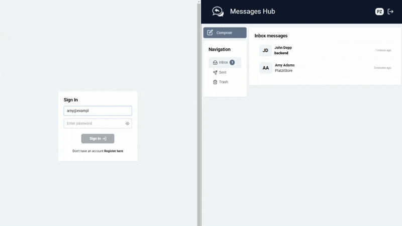

# MassageHub

This project serves as a demonstration of real-time messaging functionality.

Socket.IO is used for real-time communication, with the same functionality implemented on the local server.

For user authentication (**JWT token, Refresh token, Interceptor, Guards**), a local server built with **Express** is used ([backend-express](https://github.com/pzaydulin/backend-express)). Data management is implemented using **NgXS** (although excessive for this use case, it is included for demonstration purposes).  

Message management functionalities include: Creation, Deletion, Reading

To select a recipient from available users, **ControlValueAccessor** is utilized.

Uses: ***Angular 18.2, NgXS 18.0, PrimeNG 17.18, TailwindCSS 3.4*** 